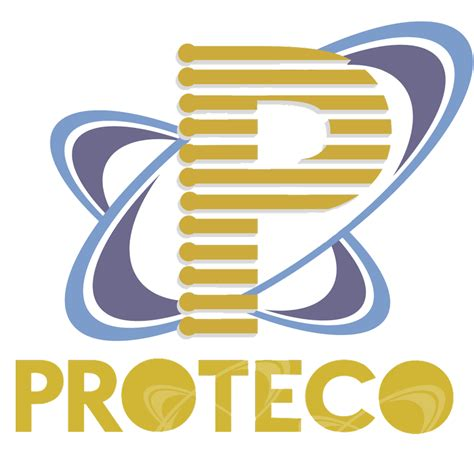

# Temario git 2

<table>
<tbody>
<tr>
<td>

</td>
<td>

</td>
<td>

</td>
</tr>
</tbody>
</table>

🚀🚀🚀 Este es el temario guía para el curso de git 2. 🚀🚀🚀

----

# 1. Trabajo con el historial. 🐸

- ¿Como reescribir el historial con amend y rebase interactivo?
- ¿Como revertir y restaurar cambios con revert y reset?
- Búsqueda de errores con bisect y blame.

---

# 2. Trabajo con herramientas avanzadas. 🐫

* ¿Como guardar cambios temporales con stash?

* Aplicación de cambios selectivos con cherry-pick

*  Uso de hooks y alias para automatizar tareas.

*  ¿Como trabajar con submódulos y subtrees?.

---

# 3. Trabajo en equipo. 🌒

* Colaboración con otros desarrolladores usando un flujo de trabajo (workflow)
  adecuado.

* Asignación de roles y permisos.

* Uso de etiquetas e hitos.

* Revisión de códigos y comentarios.

---

# 4. Buenas prácticas de git y github. ✨

* Escribir mensajes de commit claros y concisos.

* Uso de estilo de código consistente.

* Documentación de proyectos con README.md y otros archivos.

* Uso de licencias y códigos de conducta.

* Configuración y personalización de perfil en github.

---

